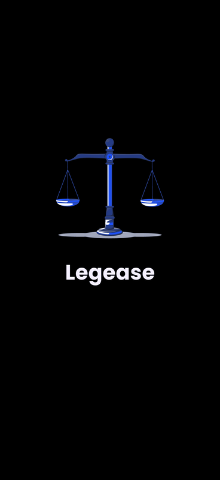
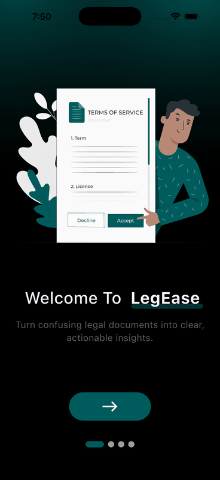
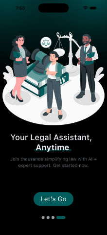

# ⚖️ Legease - AI Legal Document Analysis Platform

Navigating legal jargon shouldn't require a law degree. **Legease** is an AI-driven ecosystem designed to demystify complex contracts and agreements. By leveraging advanced NLP, it provides clause-by-clause breakdowns, identifies potential risks, and connects users with legal professionals.

## ✨ Key Features

- **Clause-by-Clause Analysis**: Demystify complex legal jargon using advanced AI.
- **Risk Identification**: Automatically flag potential risks in contracts before you sign.
- **Cross-Platform Accessibility**: Seamless experience across iOS, Android, Web, and Desktop.
- **End-to-End Encryption**: Your legal documents are yours alone, secured with industry-standard encryption.
- **Pro Connection**: Directly connect with legal professionals for expert advice.

## 🛠️ Tech Stack

- **Framework**: Flutter & Dart
- **AI/ML**: Advanced NLP for document parsing and analysis
- **Processing**: High-performance PDF processing engine
- **UI/UX**: Material Design 3 with custom high-fidelity components
- **Security**: End-to-End Encryption (E2EE)

## 📸 App Showcase

  

  
  
  

## 🎥 Watch in Action

[View Demo Video](https://youtube.com/shorts/rO3SDq69Fbc)

---
Developed with precision by [Sachin Sharma](https://github.com/maisachinsharmahu)
